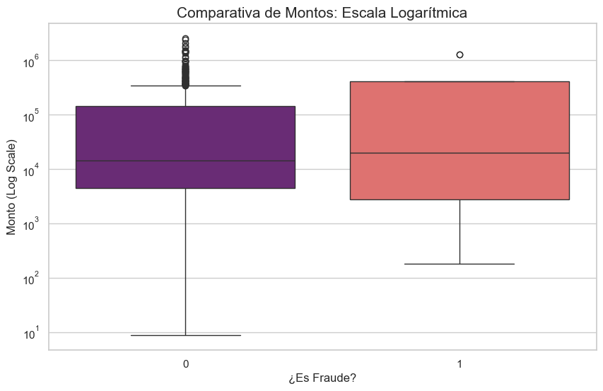

# 🛡️ FinShield: Inteligencia de Datos aplicada a la Prevención de Fraude Financiero

## 💡 El Hallazgo Clave en una Imagen
*Los montos de fraude superan el promedio de transacciones legales y muestran patrones consistentes en los canales de transferencia y retiro en efectivo.*

### 🎯 Contexto Estratégico (PaySim)
Debido a la naturaleza privada de las transacciones financieras, este proyecto utiliza **PaySim**, un simulador sofisticado que genera datos sintéticos basados en logs reales de un servicio de dinero móvil que opera en más de 14 países. Mapeé un mes de operación (744 horas) para identificar comportamientos maliciosos donde agentes fraudulentos intentan vaciar cuentas.

## 🕵️‍♂️ Principales Descubrimientos de Riesgo

#### 🗂️ Concentración de Riesgo Quirúrgico
Se determinó que el fraude no es aleatorio; ocurre quirúrgicamente **solo** en dos tipos de movimientos: `TRANSFER` y `CASH_OUT`.

#### 📊 Desbalance Crítico
El dataset presenta un fuerte desbalance de clases (**0.9% fraude**), lo que requiere métricas de evaluación específicas para minimizar pérdidas financieras.

#### 📈 Patrón de Montos
A través de un análisis de **escala logarítmica**, se visualizó que las transacciones fraudulentas tienden a tener montos más elevados y consistentes que las legítimas.

---

## 🛠️ Stack Tecnológico
* **Python 3.14+** (Núcleo de análisis y procesamiento lógico).
* **Pandas / Numpy** (Limpieza y transformación de millones de registros).
* **Seaborn / Matplotlib** (Visualización estratégica de anomalías y boxplots).

---
**Analista:** Víctor Vázquez | Estudiante de Negocios Digitales (ULA)
[LinkedIn](https://www.linkedin.com/in/victorvazquez-dataanalyst) | [Portafolio](https://github.com/VictorVM-03)
